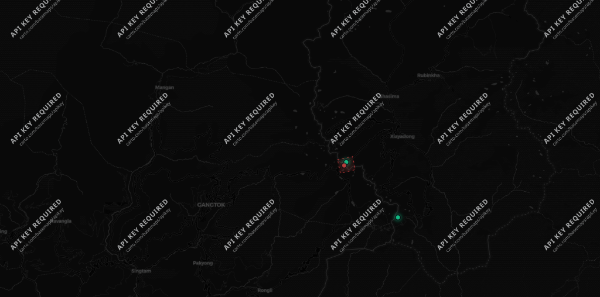
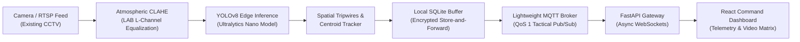
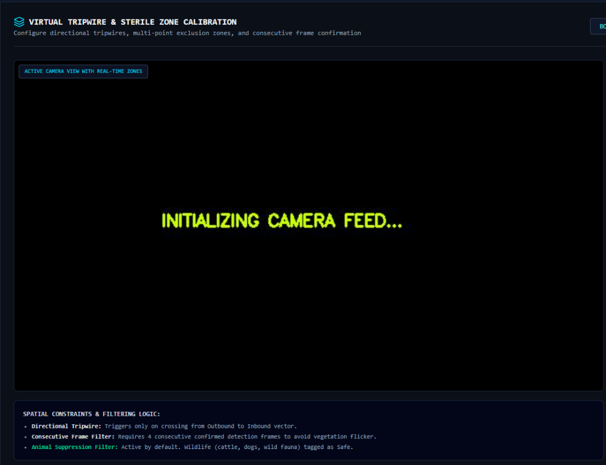
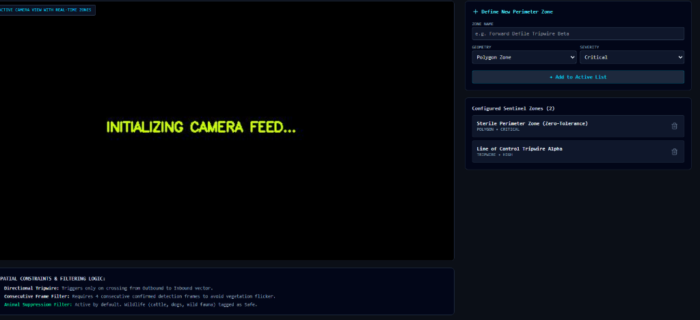
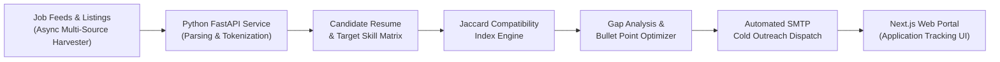
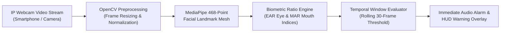
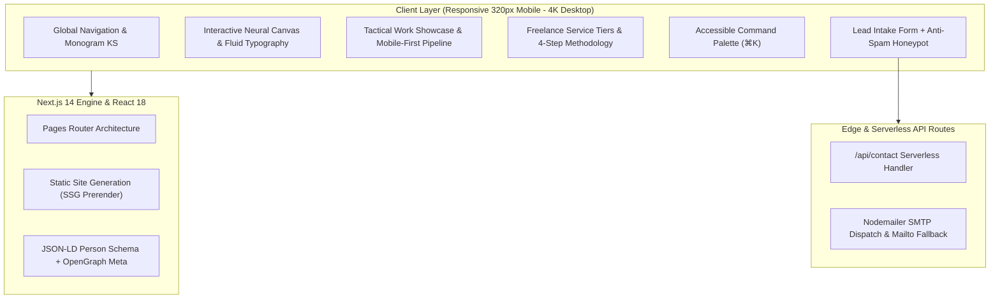

<div align="center">

# Kavya Shaw — AI/ML Developer & Web Engineer

<p align="center">
  <strong>Dual-Purpose Developer Portfolio & Freelance Client Acquisition Engine</strong>
</p>

[](https://nextjs.org/)
[](https://reactjs.org/)
[](https://tailwindcss.com/)
[](https://github.com/kavya0704/kavya-portfolio/actions)
[](https://opensource.org/licenses/MIT)
[](https://vercel.com/)

<br />

[Explore Live Demo](https://kavya-portfolio.vercel.app) • [View Flagship Project](#-flagship-project-raksha-ai-20) • [Local Setup](#-local-installation--setup) • [Connect with Kavya](https://www.linkedin.com/in/kavya-shaw-025b5a251/)

</div>

---

## 🧭 Executive Summary

This repository houses the complete source code for **Kavya Shaw's** personal developer portfolio, freelance service platform, and interactive engineering showcase. 

Designed and built to high standards, the platform balances two strategic goals:

1. **Internship & Technical Role Acquisition**: Highlights core software engineering and AI/ML competencies through real-world prototypes like **RAKSHA AI 2.0** (Smart India Hackathon problem statement **SIH26187**), **CareerAI Copilot**, and **DrowsiGuard Pro**.
2. **Freelance Website Client Acquisition**: Delivers a transparent value proposition, concrete service offerings (Landing Pages, Business Websites, Custom Web Experiences), a 4-step execution methodology, and frictionless enquiry pathways.

---

## 🎯 Live Prototypes & Verified Links

| Project | Live Prototype | Source Repository | Primary Stack |
| :--- | :--- | :--- | :--- |
| **RAKSHA AI 2.0 (Flagship)** | [raksha20-ten.vercel.app](https://raksha20-ten.vercel.app/) | [kavya0704/raksha2.0](https://github.com/kavya0704/raksha2.0) | YOLOv8 • OpenCV • FastAPI • MQTT • WebSockets • React |
| **CareerAI Copilot** | [career-ai-web.vercel.app](https://career-ai-web.vercel.app/) | [kavya0704/job-agent](https://github.com/kavya0704/job-agent) | Next.js • Python Scrapers • Jaccard Index • SMTP |
| **DrowsiGuard Pro** | [deploy-five-theta-92.vercel.app](https://deploy-five-theta-92.vercel.app/) | [kavya0704/DrowsiGuard-PRO](https://github.com/kavya0704/DrowsiGuard-PRO) | MediaPipe 468-Mesh • OpenCV • Python • Client Inference |
| **Developer Portfolio** | [kavya-portfolio.vercel.app](https://kavya-portfolio.vercel.app) | [kavya0704/kavya-portfolio](https://github.com/kavya0704/kavya-portfolio) | Next.js 14 • Tailwind CSS • Lucide Icons |

---

## 🛡️ Flagship Project: RAKSHA AI 2.0

> **Smart India Hackathon Prototype (SIH26187) · Ministry of Home Affairs**

RAKSHA AI 2.0 is a military-grade, edge-first computer vision and surveillance retrofit engineered to turn passive border CCTV cameras into an autonomous intelligence ecosystem.

<div align="center">
  
  <p><em>RAKSHA AI 2.0 Tactical Video Wall & Zulu Mission Clock Dashboard</em></p>
</div>

### System Architecture Flow



### Visual Subsystems Gallery

<div align="center">
  <table>
    <tr>
      <td width="50%">
        
        <br />
        <p align="center"><strong>LWIR Thermal Incursion Tracking & Reticle HUD</strong></p>
      </td>
      <td width="50%">
        
        <br />
        <p align="center"><strong>Live Bounding Reticle & Sterile Zone Geometry</strong></p>
      </td>
    </tr>
  </table>
</div>

---

## 🤖 Secondary AI/ML & Web Projects

### 1. CareerAI Copilot — Unified Job Discovery & Outreach Suite
> **Live Prototype**: [career-ai-web.vercel.app](https://career-ai-web.vercel.app/) · **Repository**: [kavya0704/job-agent](https://github.com/kavya0704/job-agent)

A distributed, event-driven SaaS-style platform that automates job scraping, candidate resume compatibility analysis, and personalized cold outreach.



### 2. DrowsiGuard Pro — AI Driver Fatigue Detection System
> **Live Prototype**: [deploy-five-theta-92.vercel.app](https://deploy-five-theta-92.vercel.app/) · **Repository**: [kavya0704/DrowsiGuard-PRO](https://github.com/kavya0704/DrowsiGuard-PRO)

A real-time driver fatigue monitor utilizing a smartphone camera as an IP webcam and laptop for on-device biometric processing with zero cloud data storage.



---

## 🏗️ Portfolio Platform Architecture



---

## ⚡ Key Engineering Features

- **Interactive Neural Fiber Canvas (`HeroCanvas.js`)**: Dynamic HTML5 flow-field animation responding to pointer velocity and honoring `prefers-reduced-motion`.
- **Global Command Palette (`⌘K` or `Ctrl+K`)**: Keyboard-driven quick-jump navigation modal accessible throughout the site.
- **Dual Device Ratio Adaptation**:
  - **Mobile Phones (< 640px)**: Switches complex diagrams to streamlined, full-width vertical pipelines; adapts buttons into thumb-friendly tap targets (`min-h-[44px]`); prevents text cutoffs via strict `overflow-wrap: break-word`.
  - **Laptops & Desktops**: Displays 2D spatial circular node diagrams, 3D card perspective tilt with specular highlights, and wide multi-column grids.
- **Freelance Conversion Pipeline**:
  - 3 concrete service offerings with transparent scope and deliverables.
  - 4-step "From Idea to Launch" methodology.
  - Interactive contact form with anti-spam honeypot, server-side validation (`/api/contact`), and mailto fallback.
- **Performance & SEO Architecture**:
  - Next.js static prerendering for `/`, `/404`, and dedicated case study route `/projects/raksha-ai`.
  - Structured Data schema (JSON-LD `Person` & `WebSite`).
  - OpenGraph cards, Twitter tags, `sitemap.xml`, and `robots.txt`.

---

## 🗂️ Project Directory Structure

```
kavya-portfolio/
├── .github/
│   ├── ISSUE_TEMPLATE/
│   │   ├── bug_report.md          # Structured bug report template
│   │   └── feature_request.md     # Feature suggestion template
│   ├── workflows/
│   │   └── ci.yml                 # GitHub Actions lint & build workflow
│   └── pull_request_template.md   # PR guidelines & checklist
├── components/
│   ├── layout/
│   │   ├── Navbar.js              # Monogram KS, active tracking, theme switch
│   │   └── Footer.js              # Dynamic year, back-to-top, direct channels
│   ├── sections/
│   │   ├── Hero.js                # Availability badge, responsive CTAs
│   │   ├── SelectedWork.js        # Flagship RAKSHA AI card + 2 secondary cards
│   │   ├── RakshaCaseStudyModal.js# Interactive deep-dive modal
│   │   ├── Services.js            # 3 freelance service offerings
│   │   ├── FreelanceProcess.js    # 4-step execution methodology
│   │   ├── FreelanceCTA.js        # Conversion banner
│   │   ├── AboutMe.js             # Narrative bio + 4 factual credential cards
│   │   ├── TechnicalSkills.js     # Categorized skills (no fake percentage bars)
│   │   ├── ExperienceTimeline.js  # SKFGI, certifications, hackathons
│   │   └── ContactSection.js      # Form with honeypot & mailto fallback
│   └── ui/
│       ├── CommandPalette.js      # Accessible Cmd+K quick navigation modal
│       ├── HeroCanvas.js          # Interactive neural fiber flow field
│       ├── SpotlightTracker.js    # Hardware-accelerated cursor & scroll variables
│       ├── Toast.js               # Visual feedback toasts
│       └── SocialIcons.js         # Pixel-perfect GitHub & LinkedIn SVG icons
├── data/
│   ├── profile.js                 # Bio, contact, education, certifications
│   ├── projects.js                # Project specs, verified URLs, diagrams
│   ├── services.js                # Freelance packages & methodology
│   └── skills.js                  # Technical skill taxonomy & learning ticker
├── pages/
│   ├── _app.js                    # Theme provider, transitions, viewport
│   ├── _document.js               # JSON-LD Schema.org, Google Fonts
│   ├── 404.js                     # Custom on-brand 404 page
│   ├── index.js                   # Master single-page application
│   ├── api/contact.js             # Form validation & email dispatch
│   └── projects/raksha-ai.js      # Dedicated full-page case study
├── public/
│   ├── projects/raksha-ai/        # Authentic screenshots (dashboard, thermal, hud)
│   ├── resume/                    # Kavya_Shaw_Resume.pdf
│   ├── robots.txt & sitemap.xml   # Search engine crawl configs
│   └── favicon.svg & favicon.ico  # Monogram KS browser icons
├── styles/globals.css             # Tailwind tokens, dark mode, animations
├── .eslintrc.json                 # Next.js core-web-vitals lint rules
├── LICENSE                        # MIT License
└── package.json                   # Scripts and project dependencies
```

---

## 🛠️ Technology Stack

| Domain | Technologies |
| :--- | :--- |
| **Frontend Framework** | [Next.js 14](https://nextjs.org/) (Pages Router) • [React 18](https://reactjs.org/) |
| **Styling & Design** | [Tailwind CSS 3.4](https://tailwindcss.com/) • PostCSS • Autoprefixer |
| **Icons & Visuals** | [Lucide React](https://lucide.dev/) • Custom Scalable SVGs • HTML5 Canvas |
| **Typography** | Inter (Sans) • JetBrains Mono (Monospace) |
| **AI / Machine Learning** | YOLOv8 • OpenCV • MediaPipe Face Mesh • CLAHE Enhancement |
| **Backend & Microservices** | Python 3.11 • FastAPI • SQLite • MQTT • WebSockets • REST |
| **Quality & CI/CD** | ESLint 8 • GitHub Actions CI • Vercel Edge Network |

---

## 📦 Local Installation & Setup

Follow these steps to run the portfolio on your local machine:

### 1. Prerequisites
- Node.js 18.x or later installed
- npm or yarn package manager

### 2. Clone Repository
```bash
git clone https://github.com/kavya0704/kavya-portfolio.git
cd kavya-portfolio
```

### 3. Install Dependencies
```bash
npm install
```

### 4. Configure Environment (Optional)
```bash
cp .env.example .env.local
```
*(If left empty, contact form requests log to console and fall back to email clients seamlessly)*

### 5. Start Development Server
```bash
npm run dev
```
Open [http://localhost:3000](http://localhost:3000) in your browser.

### 6. Production Build & Lint Check
```bash
# Verify code quality with ESLint
npm run lint

# Generate optimized static production bundle
npm run build

# Preview production build locally
npm run start
```

---

## ⚙️ How to Customize Information

All portfolio data is decoupled from presentation components:

- **Bio, Education & Social Links**: Modify [`data/profile.js`](data/profile.js).
- **Projects & Prototypes**: Modify [`data/projects.js`](data/projects.js).
- **Freelance Services & Process**: Modify [`data/services.js`](data/services.js).
- **Skills Taxonomy**: Modify [`data/skills.js`](data/skills.js).
- **Update Résumé PDF**: Replace [`public/resume/Kavya_Shaw_Resume.pdf`](public/resume/Kavya_Shaw_Resume.pdf).

---

## 🚢 Deployment to Vercel

The fastest way to deploy this application is using the [Vercel Platform](https://vercel.com/new):

1. Push your changes to GitHub:
   ```bash
   git add .
   git commit -m "feat: complete developer portfolio"
   git push origin main
   ```
2. Import `kavya0704/kavya-portfolio` into Vercel.
3. Vercel automatically detects Next.js.
4. Click **Deploy**.

---

## 👤 Author

**Kavya Shaw**
- **Education**: B.Tech CSE (AI/ML) · Supreme Knowledge Foundation Group of Institutions (SKFGI), Kolkata, India
- **GitHub**: [@kavya0704](https://github.com/kavya0704)
- **LinkedIn**: [linkedin.com/in/kavya-shaw-025b5a251](https://www.linkedin.com/in/kavya-shaw-025b5a251/)
- **Email**: `kavya.shaw.tech@gmail.com`

---

## 📄 License

This project is licensed under the MIT License — see the [LICENSE](LICENSE) file for details.
